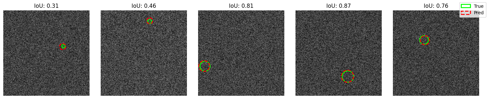

#  Circle Detection Using CNNs - Final Project Report from JJ Zhang

##  Objective

The goal of this challenge was to build a **CNN from scratch** to predict the **position (row, col)** and **radius** of a noisy circle embedded in a 256×256 grayscale image. The circle's ground truth is compared using **Intersection-over-Union (IoU)** with a performance target of 80%+ at a 0.7 IoU threshold.

All model components had to be **custom-built** with no transfer learning or pretrained backbones.

##  Project Files

The following files are included in this submission:

- `circle_finder_cnn_JJ.ipynb`: Jupyter notebook containing the complete model implementation, training code, and evaluation
- `circle_finder_model_JJ_Zhang.pkl`: Saved weights of the best performing model
- `report_JJ.pdf`: Brief summary of model architecture and key results


---

##  Final Base CNN Pipeline

### Data Generation

- Data is generated **on-the-fly** using the provided `generate_circle()` function.
- Each image contains one synthetic circle with noise (level 2).
- **Labels** are normalized `[row, col, radius]` into `[0, 1]` for training stability.
- **Training set size**: 20,000 samples; **Validation set size**: 2,000 samples
- **Both training and validation sets** are generated dynamically to avoid Google Drive I/O throttling.
- Due to dynamic generation, there is inherent randomness in each epoch's dataset, providing natural augmentation.

###  Model Architecture

| Component       | Details                                        |
|----------------|------------------------------------------------|
| Input           | Grayscale image `(1, 256, 256)`                |
| Conv Layer 1    | `Conv2d(1 → 16, kernel=5, padding=2)` + BN + ReLU + Pool + Dropout2d(0.15) |
| Conv Layer 2    | `Conv2d(16 → 32, kernel=5, padding=2)` + BN + ReLU + Pool + Dropout2d(0.15) |
| Conv Layer 3    | `Conv2d(32 → 64, kernel=5, padding=2)` + BN + ReLU + Pool + Dropout2d(0.15) |
| Flatten         | Reshape to `(batch_size, 64*32*32)`            |
| FC Layer 1      | `Linear(64*32*32 → 1024)` + BN + ReLU + Dropout(0.3) |
| FC Layer 2      | `Linear(1024 → 128)` + BN + ReLU + Dropout(0.3) |
| Output Layer    | `Linear(128 → 3)` + Sigmoid (for [0, 1] range) |

The architecture incorporates comprehensive regularization techniques:
- **Batch Normalization (BN)** after each layer stabilizes training and accelerates convergence
- **Dropout2d(0.15)** after each convolutional block prevents overfitting in feature maps
- **Dropout(0.3)** after each fully connected layer prevents overfitting in dense layers

This deep architecture with cascading regularization provides robust feature extraction while maintaining generalization capability.


###  Data Handling Strategy

Due to **Google Colab I/O limits**, the approach included:

- Replacing fixed validation dataset with **on-the-fly** generation


---

##  Loss Function

A custom loss function was developed to align with the IoU-based evaluation metric:

```python
def combined_loss(pred, target, alpha=0.6):
    """Combined MSE and enhanced IoU loss."""
    mse_component = F.mse_loss(pred, target)
    iou_component = iou_loss(pred, target, target_threshold=0.7)
    
    return alpha * iou_component + (1-alpha) * mse_component
```

The `iou_component` incorporates:
1. Distance-based approximation of circle overlap
2. Radius difference penalty
3. Additional 1.5x penalty for predictions just below the critical 0.7 IoU threshold

This approach directly optimizes for the evaluation metric while maintaining stable gradients.

---

##  Optimization attempts

| Component | Final Configuration | Impact |
|-----------|---------------------|--------|
| Optimizer | Adam (lr=1e-4) | Stable convergence |
| LR Schedule | ReduceLROnPlateau (factor=0.2, patience=20) | Adapts to performance plateaus |
| Batch Size | 256 | Leverages A100 GPU capacity |
| Early Stopping | patience=20 | Prevents overfitting |
| Regularization | Batch Norm + Dropout(0.3) | Improves generalization |
| Data Generation | On-the-fly with num_workers=4 | Avoids I/O throttling |

---

##  Evaluation & Visualization

The model's performance was primarily evaluated using **Intersection-over-Union (IoU)** metrics, which directly measure the geometric overlap between predicted and ground truth circles:

- **Primary success metric**: Proportion of predictions with IoU > 0.7 (the threshold established for successful detection)
- **Threshold sensitivity**: Performance was also measured across different IoU thresholds (0.5, 0.6, 0.7, 0.8) to understand detection capabilities at varying strictness levels
- **Average IoU**: The mean IoU across all test examples provided a general measure of prediction quality

I think this visualization approach is particularly relevant for clinical applications (like tumor or anatomical structure localization), where accurately identifying the position of objects often takes precedence over perfectly delineating their boundaries. The overlays clearly show whether the model has successfully located the target structure, even if the exact boundary match varies slightly.

Here are some visualizations of the model's predictions vs the ground truth:
The red circle is the predicted circle, and the green circle is the ground truth.




##  Results Summary

The final model achieved the following metrics on the test set:

IoU Distribution:

| IoU Threshold | Accuracy |
|--------------|----------|
| > 0.5 | 75.25% |
| > 0.6 | 67.30% |
| > 0.7 | 53.85% |
| > 0.8 | 31.70% |
| > 0.9 | 6.35% |

| Metric | Value |
|--------|--------|
| Mean IoU | 0.6388 |
| Median IoU | 0.7253 |

## Loss curve for training and validation


### Alternative Approaches Explored

I also experimented with a **CNN+Circle Kernel** approach, where custom circular convolutional kernels were designed specifically for circle detection. With limited implementation time, this approach achieved metrics similar to the optimized base CNN model:

The base CNN architecture was selected as the final model following the principle that "simpler is better" when performance is comparable. The circle kernel approach, while theoretically promising, added complexity without significant performance gains in this implementation.

---


---

## Lessons & Future Improvements

Key insights gained:
- Even simplified CNNs can effectively learn geometric structure (much simpler CNN before optimization actually performed pretty well)
- Loss function design is critical for geometric tasks
- Global average pooling effectively reduces parameters while preserving performance
- Custom geometric kernels (like circle kernels) show potential but require careful implementation

Potential improvements:
- Fully differentiable IoU loss approximation
- CoordConv approach for explicit spatial awareness
- Skip connections to preserve spatial information
- Attention mechanisms for better feature focus
- Curriculum learning: starting with easier examples
- Fine-tuning the alpha weighting parameter in the combined loss function
- Further exploration of specialized convolution kernels for circle detection
- Implementing modest rotations and translations as data augmentation

This project demonstrated that careful model design and loss function engineering are more important than raw network complexity for geometric detection tasks. While standard CNNs performed well in this task, specialized geometric kernels remain a promising direction for future research.